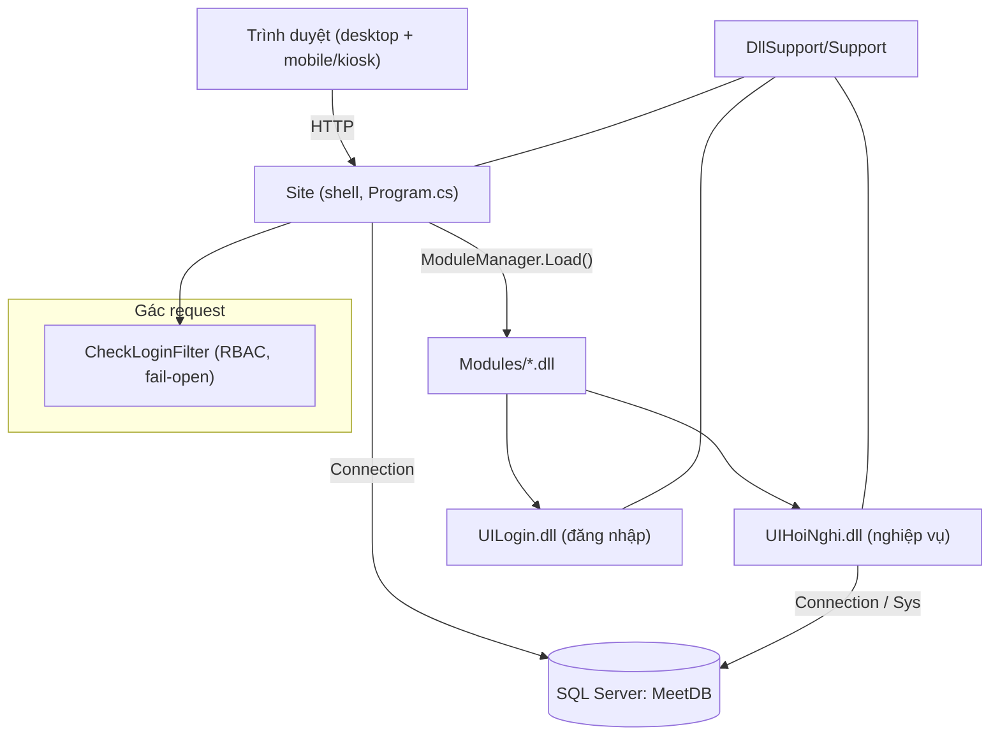
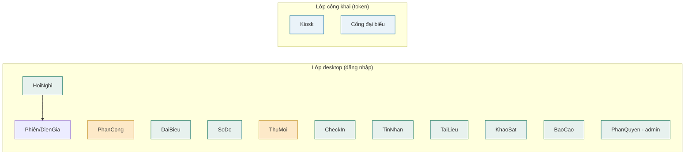
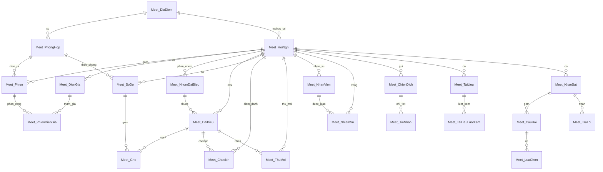
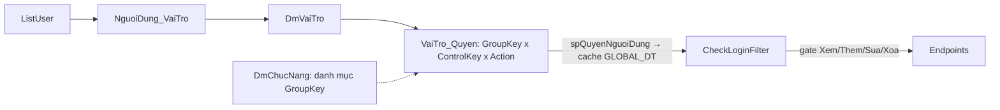

# MeetSite — CODE MAP & CODE GRAPH

> Bản đồ mã nguồn cho hệ thống **Quản lý Hội nghị Thông minh (ITKA)**. Dùng để tra cứu nhanh kiến trúc, controller/endpoint, bảng dữ liệu và quan hệ. Cập nhật: 2026-06.

---

## 1. Tổng quan kiến trúc

- **Nền tảng:** ASP.NET Core 8 (MVC), **module hóa nạp DLL động** lúc chạy.
- **Vỏ (shell):** `FronEnd/Site/Site` — desktop/taskbar, khởi tạo DB, nạp module từ thư mục `Modules/`.
- **Module nghiệp vụ:** `FronEnd/UIHoiNghi/UIHoiNghi` — toàn bộ tính năng hội nghị.
- **Module đăng nhập:** `FronEnd/UISystem/UILogin`.
- **Thư viện chung:** `DllSupport/System/Support` — `Connection`, `Sys`, `ModuleManager`, `CheckLoginFilter`, `PermissionService`.
- **CSDL:** SQL Server `MeetDB` (tự tạo + seed khi chạy lần đầu). Bảng nghiệp vụ tiền tố `Meet_*`; RBAC dùng `DmVaiTro / VaiTro_Quyen / NguoiDung_VaiTro / DmChucNang`.



### Luồng khởi động (Program.cs)
1. `ModuleManager.Load(mvc)` — đọc mọi `*.dll` trong `{BaseDir}/Modules`, nạp qua `AssemblyLoadContext`, thêm `ApplicationPart`.
2. Tạo DB `MeetDB` nếu chưa có (kết nối `master`).
3. `Sys.InitSqlStructSystem` — bảng hệ thống + seed admin.
4. Tạo bảng RBAC core + proc `spQuyenNguoiDung`.
5. `Sys.RunSqlStruct(asm)` cho từng module — chạy các `*.Struct.Schema/Stored.*.sql` nhúng (idempotent), theo thứ tự tên file.
6. Static files: Development = đọc thư mục `wwwroot`; Production = `EmbeddedFileProvider` (CSS/JS nhúng trong DLL).

---

## 2. Bản đồ thư mục

```
MeetSite/
├─ MeetSite.slnx
├─ README.md · CODE_MAP.md
├─ DllSupport/System/Support/Class/
│    Connection.cs · Support.cs (Sys) · ModuleLoader.cs · CheckLoginFilter.cs · PermissionService.cs
├─ FronEnd/
│  ├─ Site/Site/                  → vỏ desktop, Program.cs, appsettings.json, dpkeys/
│  ├─ UISystem/UILogin/           → Controller/LoginController.cs, Views/Login
│  └─ UIHoiNghi/UIHoiNghi/
│       ├─ Class/        MeetCommon.cs (MeetNav) · MeetSender.cs (IMeetSender) · MeetBaseController? (Controllers/)
│       ├─ Controllers/  *Controller.cs (xem mục 3)
│       ├─ Views/        <Tên>/Index.cshtml + Shared/_LayoutMeetWork|Mobile
│       ├─ wwwroot/      Css/meet.css · meet_mobile.css ; Script/meet_*.js
│       └─ Struct/Schema/ 01_Meet_Schema.sql · 02_Meet_Seed.sql · 03_Meet_TestData.sql
└─ TaiLieu/  HuongDan_ChiTiet_MeetSite.pdf + imgv2/*.png
```

---

## 3. Controllers & Endpoints (module UIHoiNghi)

> Tất cả kế thừa `MeetBaseController` (helper: `Query/Table/Exec/NextId/Ok/Fail/I/S/B`, `CurUser`). Mỗi controller = 1 **GroupKey** RBAC.

| Controller | GroupKey | Endpoint chính |
|---|---|---|
| **HoiNghiController** | HoiNghi | `Index/TongQuan/DanhSach`, `Combo`, `ComboPhong`, `ComboDiaDiem`, `QuickAddDiaDiem`, `QuickAddPhong`, `DashboardData`, `ListHoiNghi`, `SaveHoiNghi`, `DeleteHoiNghi`, `ListPhien`, `SavePhien`, `DeletePhien`, `ListDienGia`, `SaveDienGia`, `DeleteDienGia` |
| **PhanCongController** 🆕 | PhanCong | `ListNhanVien`, `ComboNhanVien`, `SaveNhanVien`, `DeleteNhanVien`, `ListNhiemVu`, `SaveNhiemVu`, `SetTrangThai`, `DeleteNhiemVu`, `TienDoNhanVien` |
| **DaiBieuController** | DaiBieu | `ListDaiBieu`, `SaveDaiBieu` (NamSinh/SoCCCD/MaNFC), `DeleteDaiBieu`, `ImportDaiBieu`, `GenQR`, `ListNhom`, `ComboNhom`, `SaveNhom`, `DeleteNhom` |
| **SoDoController** | SoDo | `GetSoDo` (theo IDPhongHop), `ComboPhong`, `GenSeats`, `AddGhe`, `MoveGhe`, `SaveGhe`, `DeleteGhe`, `AssignGhe`, **`RandomAssign`** 🆕, `SaveLayout`, `ChotSoDo` |
| **ThuMoiController** 🆕 | ThuMoi | `ListThuMoi`, `MacDinhHoiNghi`, `ThongKe`, `SaveThuMoi`, `SaoChep`, `DeleteThuMoi`, `GuiRieng`, `GuiTatCa` |
| **CheckInController** | CheckIn | `Stats`, `ListCheckIn`, `ChuaCheckIn`, `ManualCheckIn`, `UndoCheckIn` |
| **TinNhanController** | TinNhan | `ListMauTin`, `SaveMauTin`, `DeleteMauTin`, `ListChienDich`, `SaveChienDich`, `DeleteChienDich`, `SendChienDich`, `ListTinNhan` |
| **TaiLieuController** | TaiLieu | upload, phân quyền nhóm, chia sẻ QR, lượt xem |
| **KhaoSatController** | KhaoSat | thiết kế phiếu (câu hỏi/lựa chọn), QR |
| **BaoCaoController** | BaoCao | `Kpi` (gồm tỷ lệ gửi thư mời + check-in theo phương thức 🆕), `KetQuaLuaChon` |
| **PhanQuyenController** | PhanQuyen | **chỉ admin** (`OnActionExecuting` → 403): `ListVaiTro/SaveVaiTro/...`, ma trận quyền, gán user |
| **MeetPublicController** | (công khai) | `Kiosk/DaiBieu/KhaoSat` (view), `CheckIn`, **`CheckInDinhDanh`** 🆕 (QR/NFC/CCCD/Khuôn mặt), `DanhSachKhuonMat` 🆕, `OpenTaiLieu`, `GetKhaoSat`, `SubmitTraLoi`, `Stats`, `MyInfo` |


🆕 = bổ sung mới · 🟧 (n) = module mới.

---

## 4. Mô hình dữ liệu (bảng `Meet_*`)



### Bảng & cột then chốt
| Bảng | Cột quan trọng |
|---|---|
| Meet_HoiNghi | MaHoiNghi, TenHoiNghi, NgayBatDau/KetThuc, IDDiaDiem, TrangThai(0 nháp,1 mở,2 diễn ra,3 chốt) |
| Meet_Phien | IDHoiNghi, TenPhien, IDPhongHop, ThoiGianBatDau/KetThuc, ThuTu |
| Meet_DaiBieu | IDHoiNghi, HoTen, **NamSinh, SoCCCD, MaNFC** 🆕, IDNhom, LaVIP, QRToken, TrangThaiDangKy |
| Meet_SoDo | IDHoiNghi, **IDPhongHop** (sơ đồ theo phòng), LayoutJson, DaChot |
| Meet_Ghe | IDSoDo, MaGhe, ToaDoX/Y, LoaiGhe(0 thường,1 VIP,2 dự phòng), IDDaiBieu |
| Meet_CheckIn | IDHoiNghi, IDDaiBieu, ThoiGianCheckIn, **PhuongThuc(1 QR,2 NFC,3 khuôn mặt,4 thủ công,5 CCCD)** 🆕 |
| Meet_ThuMoi 🆕 | IDDaiBieu, DiaDiem, ThoiGian, LuuY, NoiDung, Kenh(1 SMS,2 Zalo,3 Email), TrangThaiGui(0 chưa,1 đã,2 lỗi), SoLanGui |
| Meet_NhanVien 🆕 | IDHoiNghi(null=dùng chung), HoTen, VaiTroTC, Active |
| Meet_NhiemVu 🆕 | IDNhanVien, IDPhien, TenNhiemVu, ThoiHan, DoUuTien(1/2/3), TrangThai(0/1/2) |
| Meet_ChienDich / Meet_TinNhan | chiến dịch + log gửi (Kenh, TrangThai) |
| Meet_KhaoSat/CauHoi/LuaChon/TraLoi | phiếu khảo sát + trả lời |

---

## 5. Front-end (view ↔ script)

| View (`Views/<X>/Index.cshtml`) | Script (`wwwroot/Script/`) |
|---|---|
| HoiNghi (Index/DanhSach/TongQuan) | meet_list.js · meet_hoinghi.js · meet_home.js |
| PhanCong 🆕 | meet_phancong.js (Kanban kéo-thả + biểu đồ tiến độ) |
| DaiBieu | meet_daibieu.js |
| SoDo | meet_sodo.js (chọn phòng + Random) |
| ThuMoi 🆕 | meet_thumoi.js (trạng thái gửi, gauge, sao chép) |
| CheckIn | meet_checkin.js |
| TinNhan | meet_tinnhan.js |
| TaiLieu / KhaoSat / BaoCao | meet_tailieu.js · meet_khaosat.js · meet_baocao.js |
| PhanQuyen | meet_phanquyen.js |
| MeetPublic/Kiosk | meet_kiosk.js (4 tab QR/NFC/CCCD/Khuôn mặt) |
| Shared/_LayoutMeetWork | meet_ui.js (modal/toast/form/grid helpers) |

- **Helper toàn cục** (Site shell): `jAjax`, `newGrid`, `textColumn`, `PaintBase` (Chart.js), Tabulator, TomSelect, Flatpickr, Jodit, qrcode.
- **MeetNav** (`Class/MeetCommon.cs`): khai báo menu + GroupKey; ẩn mục `AdminOnly` với non-admin.
- **IMeetSender** (`Class/MeetSender.cs`): cổng gửi `Kenh` 1 SMS / 2 Zalo / 3 Email (mock) — cắm thật bằng cách implement interface.

---

## 6. Phân quyền (RBAC)


- Seed vai trò: **BTC** (toàn quyền nghiệp vụ), **KYTHUAT** (Sơ đồ+Điểm danh; xem HoiNghi/TaiLieu/BaoCao), **LETAN** (Điểm danh; xem Đại biểu/HoiNghi).
- **Fail-open:** GroupKey không có dòng trong `VaiTro_Quyen` ⇒ không bị gác. Vì vậy `PhanQuyen` được **gác cứng admin** ngay trong controller (`OnActionExecuting` → 403).

---

## 7. Triển khai

- Publish: `D:\PubSite\MeetSite` (Site.dll + web.config ANCM in-process + `Modules/UIHoiNghi.dll,UILogin.dll`).
- Chạy nhanh: `dotnet D:\PubSite\MeetSite\Site.dll --urls http://localhost:5014`.
- IIS: cần **.NET 8 Hosting Bundle**; dùng `D:\PubSite\SETUP_IIS_MeetSite.ps1` (Administrator) tạo site cổng 5014.
- `dpkeys/`: khóa Data Protection (mã hóa cookie phiên) — giữ cố định để không bị đăng xuất khi restart.
